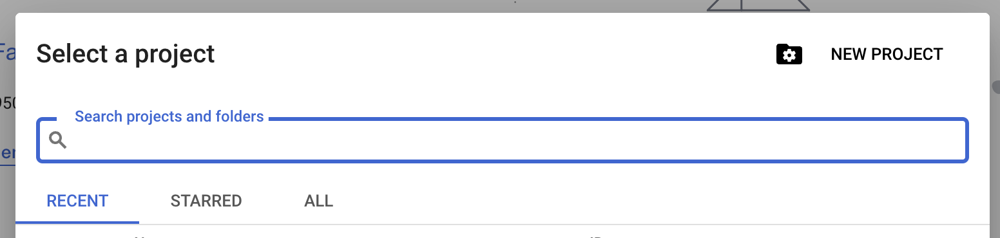
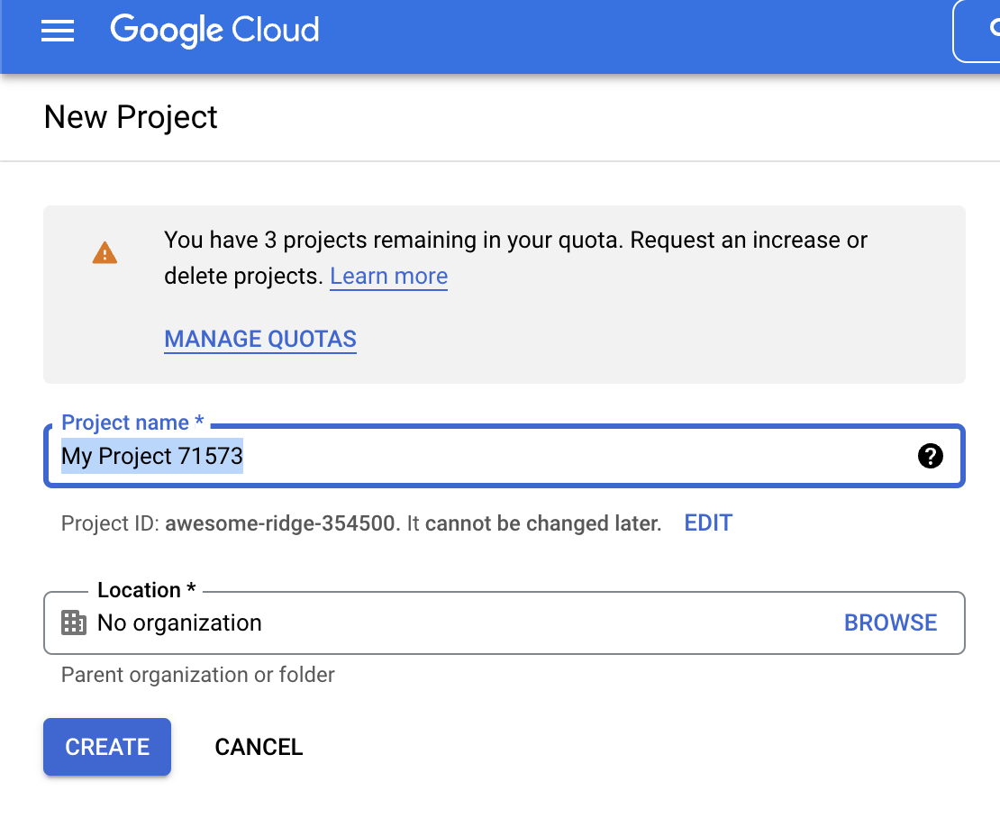
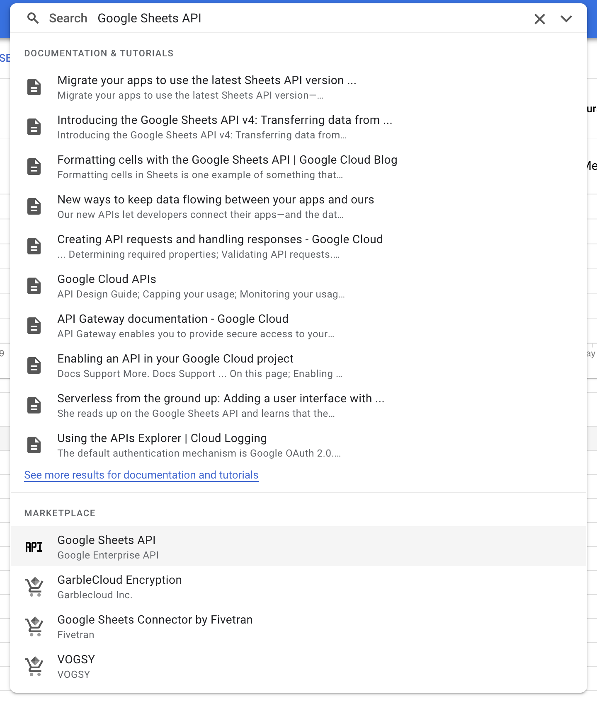
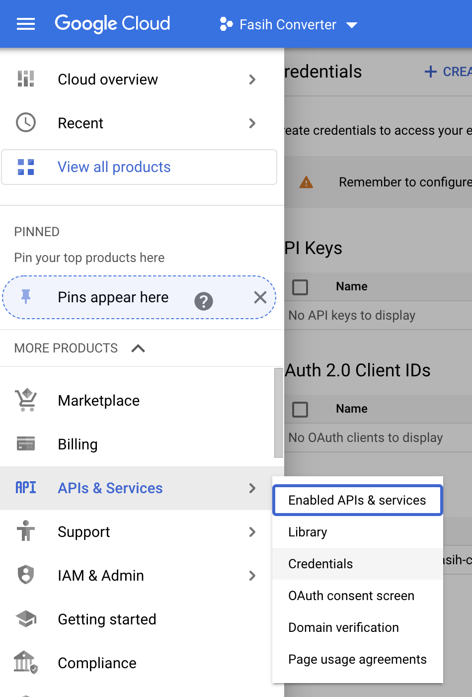
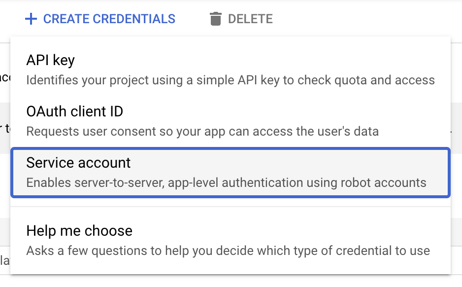
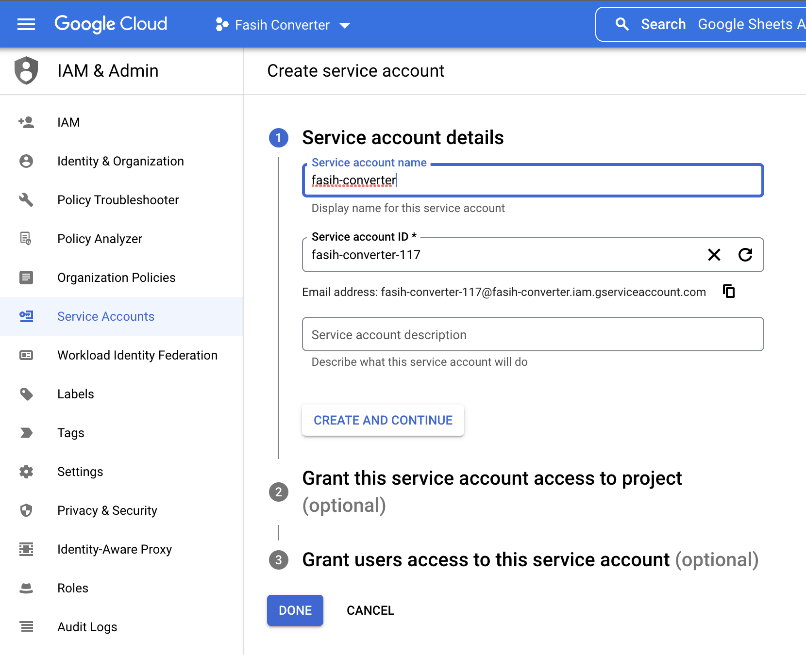
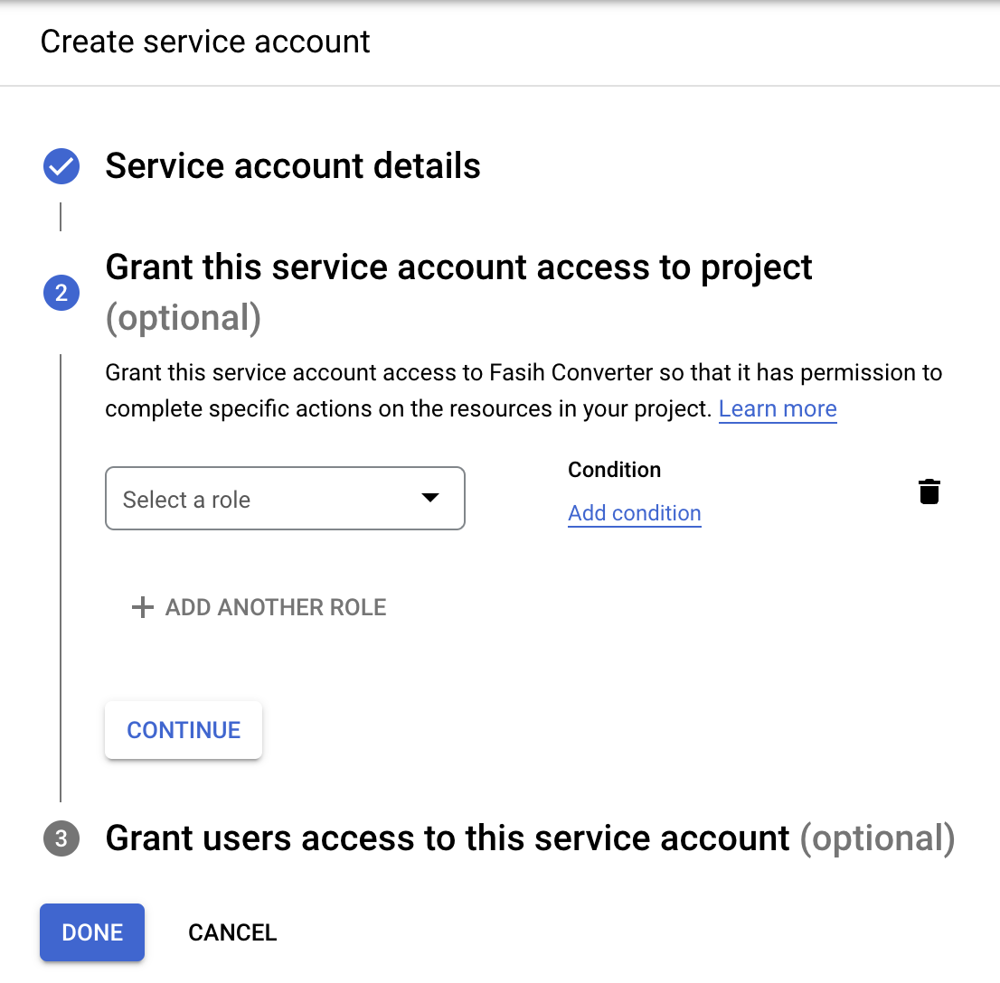
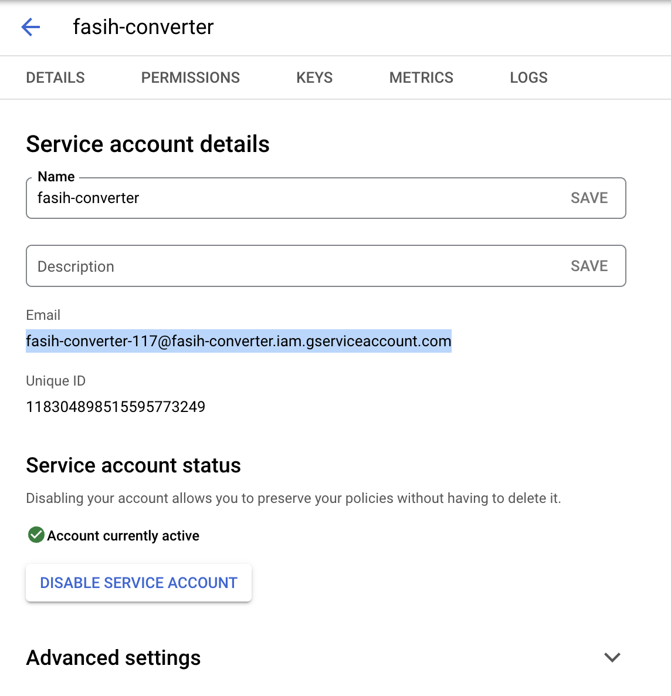

# FASIH CONVERTER

*Fasih Converter* adalah aplikasi berbasis Android & iOS yang dibangun menggunakan *framework* [Flutter](https://flutter.dev). Aplikasi ini menggunakan [Google Sheets](https://docs.google.com) sebagai *backend*.

## Requirements
1. **Pastikan Flutter SDK terbaru terinstal di perangkat anda.**
2. **Pastikan Dart SDK Terbaru telah terinstal di perangkat anda.**
3. [Android Studio](https://developer.android.com/studio) terbaru atau [Visual Studio Code](https://code.visualstudio.com/download) versi terbaru.

## Persiapan
1. Buat *spreadsheet* kosong di [Google Spreadsheet](https://docs.google.com). Beri nama sesuai kebutuhan.
2. Salin **ID** dari *sheet* yang baru saja dibuat.
> contoh : https://docs.google.com/spreadsheets/d/**{ID}**
3. Masuk ke [Google Cloud Console](https://console.cloud.google.com/). Buat project baru dengan cara seperti pada gambar. 
 
4. Masuk ke menu lalu Pilih ***API & Services***. Pilih ***Google Sheet API*** lalu tekab tombol ***Enable***.

5. Buka menu lalu Pilih ***API & Services*** >> ***Credentials***

6. Pilih ***Create Credentials*** lalu pilih ***Service Account***

7. Masukkan informasi terkait **service** pada formulir lalu tekan ***CREATE & CONTINUE***. Tekan ***CONTINUE*** sekali lagi di tahap selanjutnya. Lalu tekan ***DONE*** untuk menuntaskan proses pembuatan ***Service Account***.

9. Buat dan *Download* ***Credential Keys* dengan cara masuk ke Tab ***Keys*** lalu pilih ***ADD KEY***. Pilih ***JSON***. Browser anda akan secara otomatis mengunduh credential key berupa file JSON. Copy file ini ke folder ***assets/credentials*** lalu rename menjadi ***fasih-converter.json***
8. Lihat detail dari ***credentials*** yang baru saja dibuat, lalu salin ***Email*** seperti pada gambar dibawah. Masukkan alamat email ihi ke daftar sharing sheet yang akan digunakan.


## Langkah Instalasi
1. *Clone repository* ini ke local disk anda dengan menjalankan perintah berikut
```bash
# Git BPS
git clone https://git.bps.go.id/ryanaidilp/fasih-converter
```
2. Masuk ke *root directory project* lalu jalankan perintah berikut
```bash
flutter pub get
```
3. Buat file **.env** di *root directory** aplikasi anda lalu isikan dengan variabel-variabel dari file **.env.example**.
```env
GOOGLE_SHEET_ID= #Isikan Dengan ID dari Spreadsheet yang ingin digunakan
GOOGLE_SHEEt_URL= #Isikan dengan shareable url dari spreadsheet anda.
RUTA_SHEET_TITLE= #Isikan dengan nama worksheet untuk data ruta.
ART_SHEET_TITLE= #Isikan dengan nama worksheet untuk data art.
```
4. Jalankan aplikasi ke perangkat anda.
